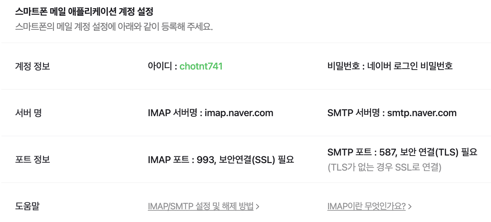

# 사용 설명서

날짜: 2023년 3월 25일

이 프로그램은 “config.json”이라는 설정파일을 읽고 실행합니다. 

해당 설정파일을 살펴보면 다음과 같은 항목들이 존재합니다.

```json
{
  "메일": {
    "아이디": "사용자명",
    "비밀번호": "비밀번호",
    "서버명": "SMTP 서버명",
    "포트정보": "SMTP 포트",
    "발신인": "사용자 이메일",
    "수신인": ["수신 이메일1", "수신 이메일2", "수신 이메일3"]
  },
  "딜레이": 5,
  "사이트": [
    {
      "주소": "https://www.nytimes.com/",
      "선택자": "main#site-content"
    }
  ]
}
```

지금부터 각 항목들을 살펴보며 원하는 값들로 수정해보겠습니다.

### 메일 항목

설정에서 해당 부분은 메일을 보내기 위한 설정입니다. 만약 네이버 메일을 사용하신다면 아래 링크의 방법을 따라하시면 됩니다. 

- [https://help.naver.com/service/30029/contents/21344?lang=ko](https://help.naver.com/service/30029/contents/21344?lang=ko)

IMAP/SMTP 사용을 설정해주신 뒤, 아래 부분을 보시면 다음 사진과 같은 구성을 확인할 수 있습니다. 이 값들을 참고하여 “config.json” 항목을 수정해주시면 됩니다.



현재 정보들로 수정한다면 메일 부분이 아래와 같이 바뀔 것 입니다 (아래는 제 계정 기준).

```json
{
  "메일": {
    "아이디": "chotnt741",
    "비밀번호": "네이버 로그인 비밀번호로 바꿔주세요!",
    "서버명": "smtp.naver.com",
    "포트정보": "587",
    "발신인": "chotnt741@naver.com",
    "수신인": ["chotnt741@naver.com"]
  },
  "딜레이": 5,
  "사이트": [
    {
      "주소": "https://www.nytimes.com/",
      "선택자": "main#site-content"
    }
  ]
}
```

### 딜레이

딜레이 항목은 해당 사이트들을 갱신하는 주기로 “분” 단위를 기준으로 하고 있습니다. 기본 설정으로는 5분을 잡아둔 것을 확인할 수 있습니다. 또한 1.5와 같이 소수점을 지원하고 있으니 원하시는 값으로 설정하시면 됩니다.

```json
{
  "메일": {
    "아이디": "chotnt741",
    "비밀번호": "네이버 로그인 비밀번호로 바꿔주세요!",
    "서버명": "smtp.naver.com",
    "포트정보": "587",
    "발신인": "chotnt741@naver.com",
    "수신인": ["chotnt741@naver.com"]
  },
  "딜레이": 5,
  "사이트": [
    {
      "주소": "https://www.nytimes.com/",
      "선택자": "main#site-content"
    }
  ]
}
```

### 사이트

사이트 항목은 변화를 감지할 사이트 목록을 적는 곳입니다. “주소”는 사이트의 URL을 의미하며 “선택자”는 페이지의 일부분이 변화하는 것을 감지할 수 있도록 하는 제공하지 않아도 되는 추가적인 값입니다.

위에서 사용된 예시에서 뉴욕타임즈 사이트의 컨텐츠 부분만을 감지하도록 설정한 것임을 알 수 있습니다. 

만약 네이버 뉴스내에서 정치, 경제, 사회 파트를 따로따로 추적하고 싶으면 아래와 같이 추가하시면 됩니다.

```json
{
  "메일": {
    "아이디": "chotnt741",
    "비밀번호": "네이버 로그인 비밀번호로 바꿔주세요!",
    "서버명": "smtp.naver.com",
    "포트정보": "587",
    "발신인": "chotnt741@naver.com",
    "수신인": ["chotnt741@naver.com"]
  },
  "딜레이": 5,
  "사이트": [
    {
      "주소": "https://news.naver.com/main/main.naver?mode=LSD&mid=shm&sid1=100"
    },
    {
      "주소": "https://news.naver.com/main/main.naver?mode=LSD&mid=shm&sid1=101"
    },
    {
      "주소": "https://news.naver.com/main/main.naver?mode=LSD&mid=shm&sid1=102"
    }
  ]
}
```

여기까지 설정하느라 고생하셨습니다. 이제는 실행파일을 클릭하여 실행시키면 됩니다.

### 프로그램 실행

프로그램을 실행시키면 cmd 창이 켜질것입니다. 

또한 다음과 같이 주기적으로 감지된 항목을 출력하고 메일을 발송해줄 것 입니다.


### 이메일 확인


다음과 같이 이메일 제목은 ‘[시간] 주소 변화’의 형태로 발송이 됩니다. 또한 본문은 어떤 부분이 변화했는지를 알려주는 부분입니다. 시작이 “+”로 시작되는 부분은 새로 추가된 부분이며, “-”로 시작하는 부분은 저장된 값에서 사라진 부분을 나타냅니다.
